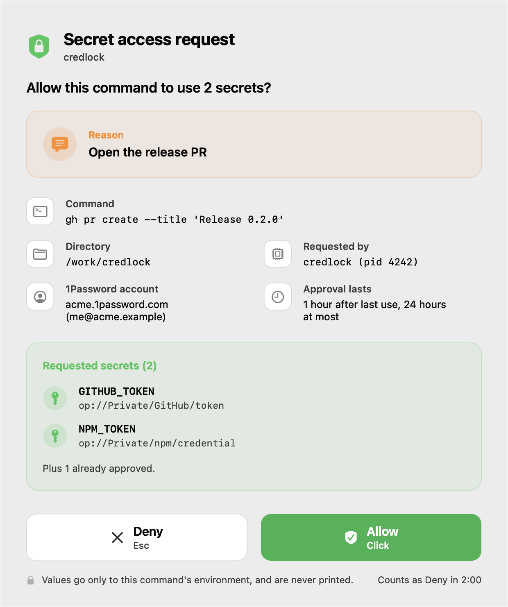
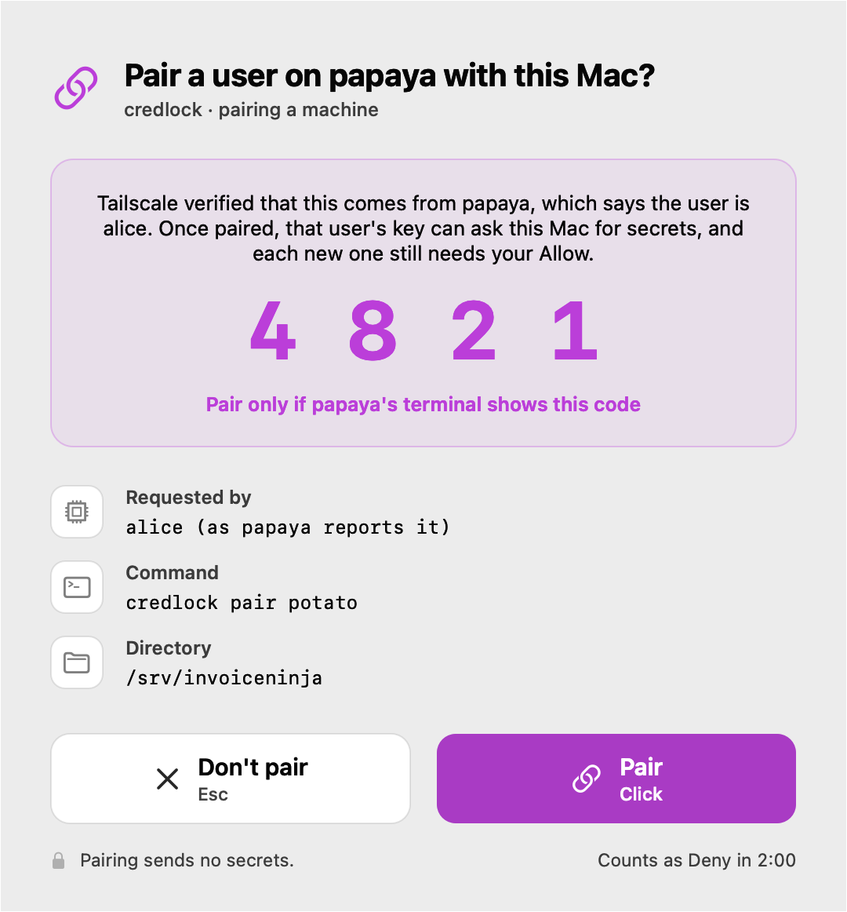

# credlock

credlock hands secrets to one command at a time, after you've seen exactly what
is being asked for, by whom, and why.

```bash
GITHUB_TOKEN='op://Personal/GitHub/token' \
  credlock run --account my --reason "list my open pull requests" -- gh pr list
```

The first time, an approval window shows the reason, the command, the
directory, the requesting process, and each secret it wants. If you allow it,
credlock fetches everything it is missing from 1Password in one call and runs
the command with the real values in its environment. An approval lasts an hour after its
last use, and a day at most, so the next hour of runs needs no prompt at all.

<picture>
  <source media="(prefers-color-scheme: dark)" srcset="docs/images/approval-window-dark.png">
  
</picture>

It was written for coding agents, which run each command in a fresh shell with
no terminal. There, a bare `op read` asks for Touch ID on every call, because the
1Password CLI ties its approval to a terminal. credlock's helper is one
long-lived process, and the 1Password SDK ties its approval to a process.

Secret values never touch stdout, a command line, disk, or an agent's
transcript. Only the command you approve receives them.

## Setup

1. In the 1Password app, open **Settings → Developer** and, under
   **Integrate with the 1Password SDKs**, choose **Integrate with other apps**.
2. Install it, one of these ways:
   - Homebrew: `brew install cdmckay/tap/credlock`
   - Nix: `nix profile install github:cdmckay/credlock`
   - Go, with Apple's command line tools for cgo:
     `go install github.com/cdmckay/credlock/cmd/credlock@latest`
3. Tell credlock which account the secrets are in, with `--account` or
   `CREDLOCK_ACCOUNT`. It takes the account ID (the `account_uuid` column of
   `op account list`), the sign-in address or its first part (`my`), your
   email, or the account's name as shown in the app. Run `credlock run` with no
   account to list the accounts set up on the machine.

References use the SDK's syntax, `op://vault/item/field`. The built-in
vault's name differs from the `op` CLI's, and crosses over: in a personal
account the SDK calls it `Personal` (`op` also takes `Private`), while in
1Password Business the SDK calls it `Private` (the app and `op` show
`Employee`). A `vaultNotFound` error lists the account's vaults.

## Other machines on your tailnet

A machine without 1Password, such as a Linux server, can still use
`credlock run`: it asks a Mac on the same Tailscale network, which shows its
approval window, fetches from 1Password, and sends the values back over the
tailnet. The other machine keeps nothing; every run asks again, and a Mac
that holds an approval for it answers without a window.

**This needs [Tailscale](https://tailscale.com)** on the Mac and on every
machine that asks it, all in one tailnet, with MagicDNS on. credlock relies
on Tailscale to say which machine is asking, and asks Macs by their
Tailscale names. Without Tailscale there is no hub mode; credlock on a
single Mac needs none of this.

1. **On the Mac:** `credlock hub on`. It remembers the tailnet the Mac is on,
   listens only there, and adds a login item, so it keeps answering after a
   restart. `credlock hub status` lists the machines paired with it, and
   `credlock hub off` stops it, and the helper with it, forgetting every
   approval.
2. **On the other machine:** `credlock pair potato`, naming the Mac. The Mac
   shows a pairing window with a four-digit code, the terminal shows the
   same code, and its Pair button pairs them. From then on `credlock run`
   just works there. (Or set `[client] hubs = ["potato"]` in `~/.config/credlock/config.toml`,
   and the first request pairs in its own window.)

<picture>
  <source media="(prefers-color-scheme: dark)" srcset="docs/images/pairing-window-dark.png">
  
</picture>

How it's kept safe:

- **Tailscale says which machine is asking**, and the hub only listens on
  the tailnet it was turned on in. A caller's full Tailscale name must be in
  that tailnet, so a device elsewhere can't pass for one of yours.
- **A key says which user is asking, once paired.** credlock makes one for
  each user on the other machine, readable only by them, in
  `~/.local/state/credlock`. The user name is only what that machine
  reports, and the window says so. What ties a first pairing to you is its
  code: pair only if the window shows the code your terminal printed. After
  that, another user there can't ask in your name without your key.
- **Both ends prove themselves, over TLS 1.3.** The Mac has a key of its
  own too, and each side's is in the certificate it connects with, so the
  connection is encrypted and tied to both. The other machine remembers the
  Mac's key when it pairs and refuses a Mac that answers with another,
  before it sends anything. Something else holding the Mac's port, such as
  another user's program there, can't read what a paired machine asks or
  answer in the Mac's place, and the Mac's menu bar raises an alert when
  something holds the port. The pairing code comes from the TLS session and
  from a number each end adds, the Mac committing to its own before it sees
  the other's. Anything in the middle of a pairing can't steer the two codes
  to match: it matches by chance, 1 in 10,000, and each try is a pairing
  window on the Mac, which names the device asking.
- **A key that doesn't match is refused, and the Mac's menu bar key turns
  red** with an alert. Either credlock was reinstalled on that machine, which
  makes a new key, or something else is asking in its name. After a
  reinstall, re-pair on purpose: `credlock hub forget papaya` on the Mac,
  then `credlock pair` again. The same goes the other way: a machine refuses
  a Mac whose key changed until `credlock pair --forget potato` there.
- **Five pairing windows from one machine that end without Pair** (denied,
  unanswered, or given up on by the asker) refuse its pairing requests for
  an hour, so a window can't be put up again and again until it's allowed
  out of habit.
- **Approvals are kept per user and machine.** What you allow for papaya is
  papaya's alone, and nothing the Mac approved for itself is served to it.
  The window says first, in a card of its own, which machine is asking.
- **The hub serves only pairing and resolving** over the tailnet, and
  refuses its own Mac there: local requests use the local socket, where the
  kernel says which user is asking.
- **What it can't stop:** root on the other machine, or other programs
  running as you there, can use your key. New secrets still need your
  click, and every use shows in the menu bar. More under [Limits](#limits).

## Commands

| Command | What it does |
|---|---|
| `credlock run [--reason TEXT] [--account NAME] [--] COMMAND…` | Runs the command with every `op://` environment variable replaced by its secret. Exits 77 if you deny the request. |
| `credlock status` | Whether the helper is running, and what it holds: references and time left, never values. |
| `credlock clear` | Forget every approved secret. |
| `credlock stop` | Stop the helper, which forgets everything. |
| `credlock hub [on \| off \| status \| forget HOST]` | On a Mac: let paired machines on your tailnet ask it ([above](#other-machines-on-your-tailnet)). `off` also stops the helper, forgetting every approval. |
| `credlock pair [--forget] MAC` | On a machine without 1Password: pair with a Mac in hub mode, or forget its key after credlock was reinstalled there. |

## How it works

- `credlock run` finds the `op://` variables in its environment and sends them,
  with the reason, command, directory and account, to a per-user helper over a
  unix socket. It starts the helper if it isn't running.
- The helper checks with the kernel that the caller is the same user, then
  answers what it already holds. Anything new goes to the approval window, one
  at a time: a native AppKit window that the helper opens in a child process.
  Deny is the default. Esc denies and Return does nothing, so typing that lands
  on the window can't approve anything. Allow takes a mouse click, and ignores
  clicks for its first second on screen, so a click meant for another window
  can't land on it. A window left unanswered for two minutes counts as a
  denial, and one that fails or crashes never counts as Allow.
- On Allow, it resolves every missing reference in one `ResolveAll` call, in a
  resolver process for that account. The 1Password SDK can reach only one
  account per process, so each account the helper uses gets its own
  ([#8](https://github.com/cdmckay/credlock/issues/8)). The 1Password app
  shows its own approval only when its session for a resolver has lapsed,
  after ten idle minutes. A resolver that doesn't answer within three minutes,
  as when 1Password is locked, is stopped and replaced.
- The client then replaces itself with the command, holding the secrets.
- While the helper holds secrets, a key in the menu bar shows how many. It
  gets an orange dot for a few seconds whenever secrets are read, cached or
  not. Its menu is the access log, the held secrets with the time each has
  left, and Forget and Stop. It runs as another child of the helper, and is
  sent names, references and times, never values.

  <picture>
    <source media="(prefers-color-scheme: dark)" srcset="docs/images/menubar-icon-dark.png">
    
  </picture>
- The helper keeps values in memory only, drops each an hour after its last use
  or a day after its approval, and exits after an idle hour, unless hub mode
  is on.

The socket lives in `~/Library/Caches/credlock`, a directory credlock keeps at
mode 0700 and refuses to use if anyone else owns it.

## Limits

- Within its hour, an approved secret is served to any process running as you,
  without a prompt. Approvals are not tied to one command.
- **Known attack vector: any app with macOS Accessibility permission can click
  Allow for you.** An agent running inside such an app could approve its own
  request. Without that permission, macOS refuses scripted clicks and keystrokes
  and drops synthetic mouse events (tested), so keep terminals, IDEs and agent
  hosts out of System Settings → Privacy & Security → Accessibility. A planned,
  optional fix is to require a security-key tap after Allow
  ([#1](https://github.com/cdmckay/credlock/issues/1)).
- The window records your consent. It is not a barrier against malware already
  running as you, which could read the environment of the command you
  approved.
- The command you approve can do anything with the secrets it receives, as with
  `op run`.
- **Hub mode needs Tailscale** on every machine involved, in one tailnet.
- **Other machines, in hub mode:** root on a paired machine, or another
  program running as you there, can use your credlock key. Any device in the
  tailnet can put up pairing windows, five an hour per machine, and the user
  name in them is what that machine reports. The count starts again if the
  helper restarts. A four-digit code leaves something in the middle of a
  pairing a 1 in 10,000 chance per window, so check the device the window
  names too. A machine's first contact with a Mac (`credlock pair`, a
  first request through `[client] hubs`, or pairing again after `credlock
  pair --forget`) trusts the Mac that answers, as SSH trusts a new host:
  pair only when the Mac's window shows your terminal's code, and if no
  window appeared, don't trust it. A machine remembers a Mac's key under
  the name it used, so name each Mac the same way everywhere: another name
  for it in `[client] hubs` (its full MagicDNS name, or an address) is a
  first contact too, and one with no window to check, since the Mac already
  knows the machine. The Mac has to be awake, on the tailnet, with hub mode
  on.
- Approving needs a Mac for now; other systems, such as Linux servers, ask
  one (above). The operating-system pieces sit behind `internal/platform`. On
  Linux, approvals would use a plain zenity dialog until credlock has a
  window there too.

## Releases

credlock uses [Semantic Versioning](https://semver.org). What changed in each
release is in [CHANGELOG.md](CHANGELOG.md), and how a release is cut is in
[RELEASING.md](RELEASING.md).

## License

GPL-3.0-or-later, with an additional permission to link against the 1Password
SDK and its compiled core. See [LICENSE](LICENSE) and
[LICENSE-EXCEPTION](LICENSE-EXCEPTION).
